# 生产环境中的 DAMON：经验、差距与未来方向｜会议演讲逐字稿

- 演讲者：SeongJae Park（SJ）、王炼（Lian Wang）、陈涛（Kunwu Chan）
- 演讲日期：2026 年 7 月 5 日
- 演示文稿：`DAMON-Kernel-Subsystem-for-Data-Access-Monitoring-and-Access-aware-System-Operations.pdf`、`DAMON-in-Production_王炼_陈涛(KunWuChan).pdf`
- 英文版本：[English transcript](../en/SeongJae-Park-王炼-陈涛-damon-in-production.md)

> 第一部分配图来自仓库收录的 SeongJae Park DAMON 概览演示文稿（FOSDEM’25 版本），对应本次分享中的同一组基础概念；第二部分使用本次活动的生产实践演示文稿。

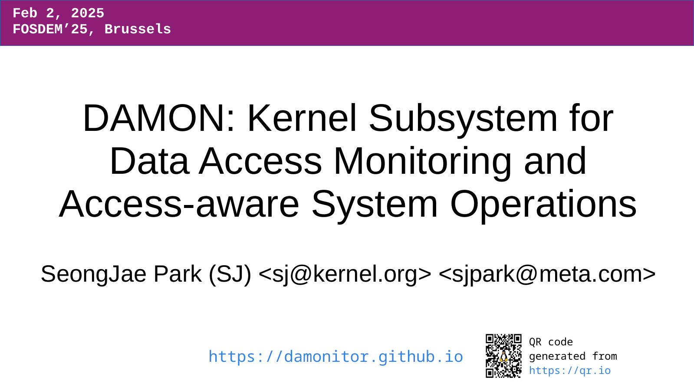

## 开场

**主持人：** 接下来请 SeongJae Park 为大家介绍 DAMON。

**SeongJae Park：** 谢谢介绍，很高兴见到中国的内核开发者。

今天我想简短介绍一下 DAMON 是什么，以及最近有哪些项目正在推进。我会先讲为什么内存效率很重要，再讲今天的 DAMON，最后谈谈它接下来可能变成什么样。

## 为什么内存效率重要

大家都喜欢数据，因为数据可以创造价值，也能给人带来乐趣。内存是数据待的地方，但内存有成本，也会消耗资源。

现在的系统通常采用分层内存：上层容量较小、速度较快，下层容量更大、速度也更慢。这给我们留下了优化空间。所谓高效的内存管理，可以理解为把重要数据放在更小、更快的内存里。

那么，什么数据重要？一个简单的回答是经常被访问的数据。我们保留数据，是因为还要访问它；如果一份数据再也不会被访问，它就没有继续占用宝贵内存的必要。

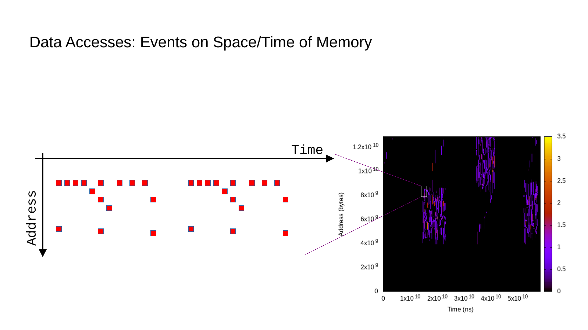

这就是 DAMON 出现的背景。DAMON 是 Linux 内核中用于数据访问监测和访问感知系统操作的子系统。

## DAMON 今天是什么

很久以前，在一家遥远的云计算公司里，有一个团队想做内存可以自动伸缩的虚拟机。他们希望虚拟机只使用真正需要的内存。要做到这一点，系统得先知道哪些数据可以移走，哪些数据应该继续留在内存中。于是，他们开发了后来进入 Linux 内核的 DAMON。

从高层看，DAMON 的实现可以用一段很短的逻辑概括：一个名为 `kdamond` 的内核线程定期检查各个监测区域是否被访问。典型配置下，它每 5 毫秒采样一次，每 100 毫秒汇总一次；这些时间间隔也可以自动调节。

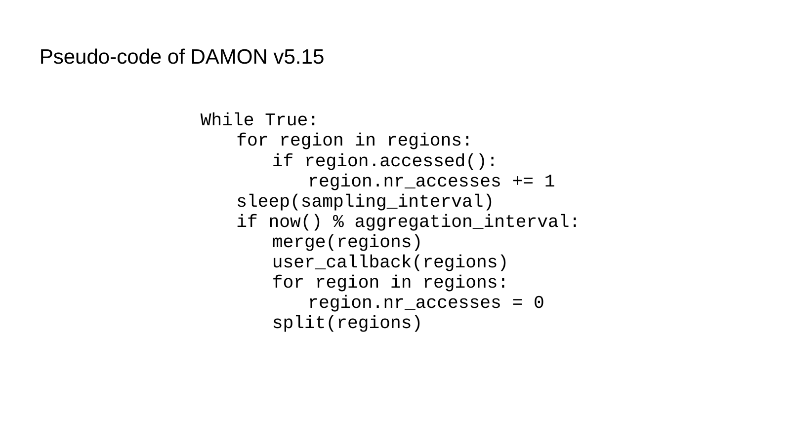

DAMON 的结果会告诉你一段内存位于哪里、访问有多频繁、访问模式是否稳定，以及最近一次访问距今多久。它通过自适应的区域划分、采样和汇总机制控制开销。用户可以设置开销上限，不论被监测的是 10 GiB 还是 10 TiB 内存，DAMON 都会在给定约束内尽力提供尽可能准确的结果。

我们在生产负载上看到过低于单个 CPU 0.1% 的开销。当然，具体数字仍取决于配置，用户可以在开销和精度之间做取舍。

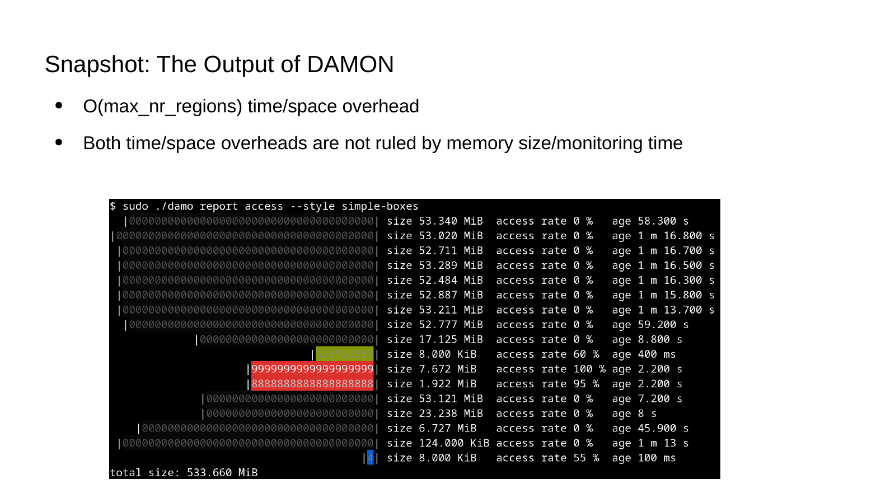

DAMON 从 Linux v5.15 起进入主线，现在已经在许多发行版内核中启用，也被回移植到一些更早的内核。研究项目和生产系统都在使用它。

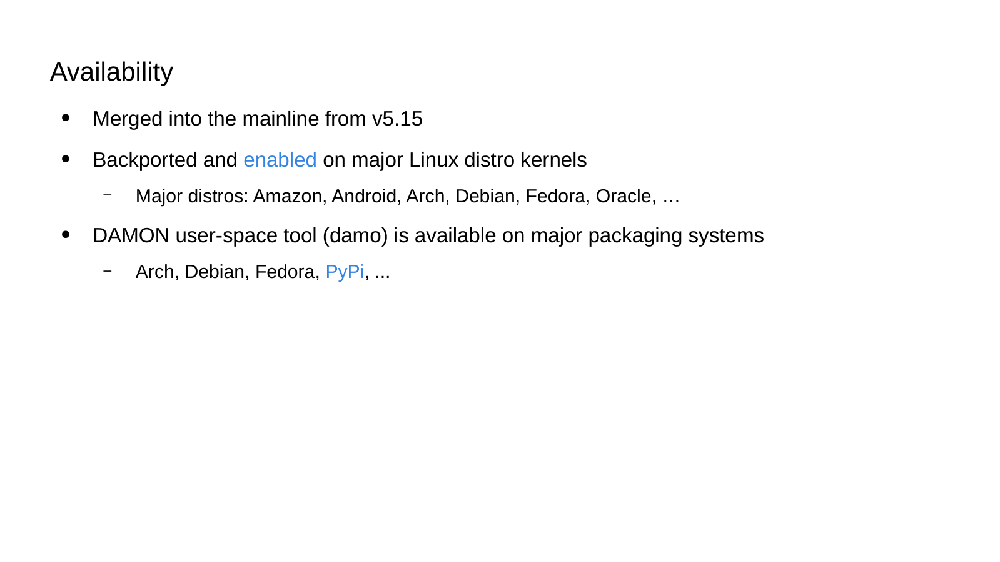

### DAMOS：把监测结果变成动作

DAMON 还有一项重要能力叫 DAMOS，即 DAMON-based Operation Schemes。用户可以让 DAMON 寻找具有特定访问模式的内存，再对它们执行指定操作。例如，换出冷内存，或者在不同 NUMA 节点之间迁移冷热页面。

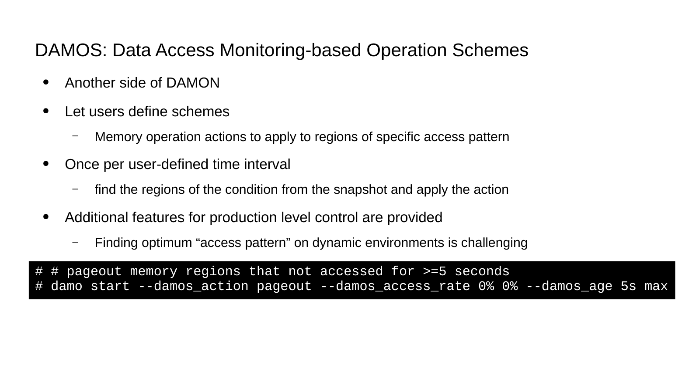

这样一来，DAMON 就不只是一个访问监测器，也是一套访问感知的系统操作引擎。

### DAMON 社区

DAMON 有公开邮件列表和项目网站。也可以直接给我发邮件。社区每两周还会举行一次非正式的 DAMON Beer/Coffee/Tea 线上交流。如果大家有问题，或者想讨论补丁，欢迎通过这些渠道联系我们。

## 未来：从数据访问扩展到数据属性

用一句话概括今天的 DAMON：它是 Linux 内核中高效的数据访问监测和访问感知系统操作子系统。再往前走，它会扩展成高效的数据属性监测与操作引擎。

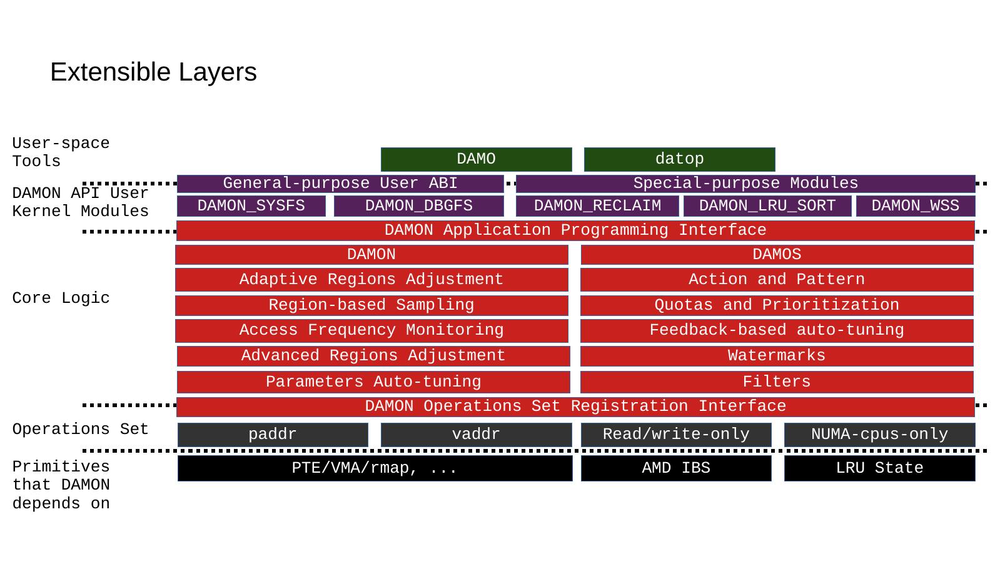

现在已经有用户提出更细致的需求，例如只监测某个 cgroup、某个 CPU 或线程，或者区分读访问和写访问。这些信息已经不只是访问频率，而是更一般的数据属性。

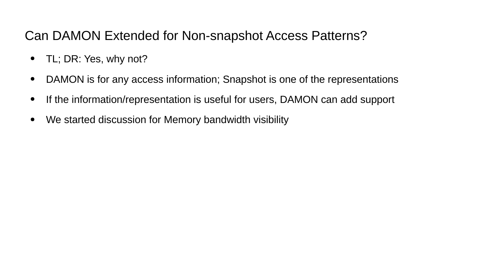

还有一些用户希望采用更强的监测原语。目前 DAMON 主要利用页表中的 Accessed bit。这种方式适合监测内存访问，但能提供的细节和精度有限。AMD IBS、Intel PEBS 和 Arm SPE 等硬件特性可以提供更专门的数据。

社区已经出现过基于 page fault 的只读、只写或按 CPU 监测方案，也有人提出把 DAMON 扩展到 perf event。针对 Arm SPE、AMD IBS 和 Intel PEBS 的具体工作也在讨论中。王炼最近提出的 Arm 方向扩展就是其中之一。

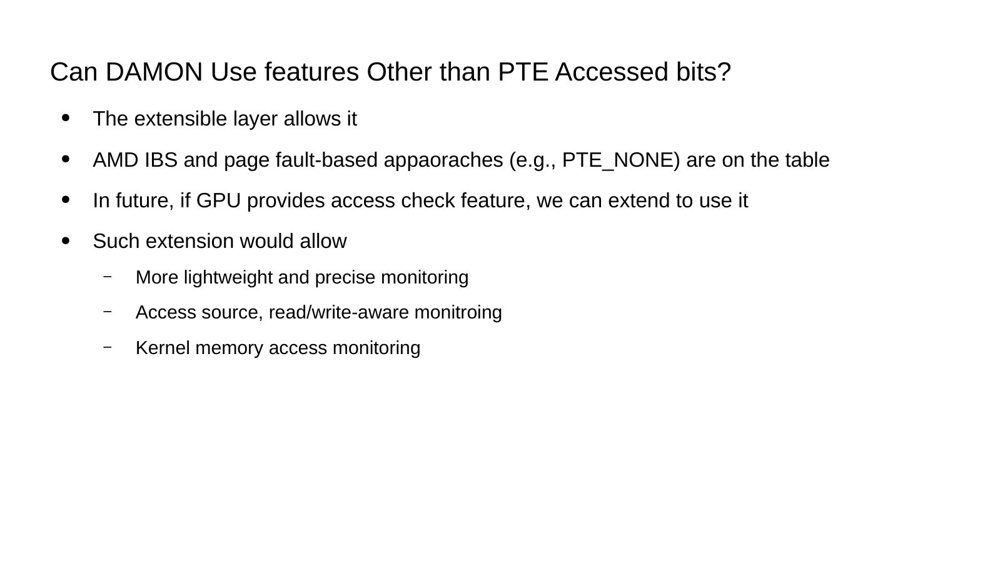

我们的计划分两步。第一步，把 DAMON 从数据访问监测与操作引擎扩展为通用的数据属性监测与操作引擎，希望在今年年底前完成。第二步，在新的基础上接入 AMD IBS、Intel PEBS、Arm SPE 等硬件能力，目标是明年上半年推进到可用状态。

这就是我今天的分享，谢谢大家。

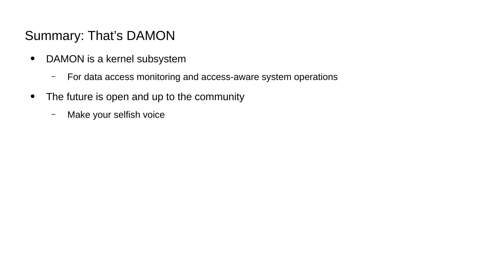

## 从生产环境问题出发

**王炼：** 这项工作是我和陈涛一起做的。开发过程中，我们也和 SJ 讨论了 DAMON 后面的发展规划，所以邀请他先做一个整体介绍。接下来我从我们的补丁说起，讲讲生产环境里遇到的问题，以及我们准备怎样继续推进。

DAMON 现在已经能满足很多使用场景。这次工作的起点是深信服反馈的一个生产问题：在开启 THP 后，DAMON 对冷热区域的采样会出现偏差。我们围绕这个问题补充 mTHP 支持，做了不少实验，也把补丁发到了邮件列表，正在根据 review 准备下一版。

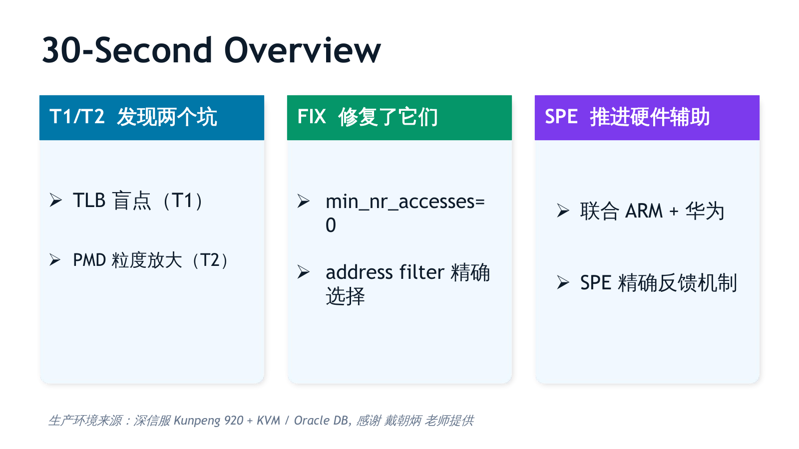

## DAMON 的基本工作方式

DAMON 传统上利用页表的 Accessed bit，也就是 AF，判断一段内存是否被访问。它把地址空间自适应地划成若干 region，定期采样，再统计访问频率和 `age`。DAMOS 根据访问模式触发 `pageout` 等操作；我们这次希望补上大页的 `collapse` 和 `split` 能力。

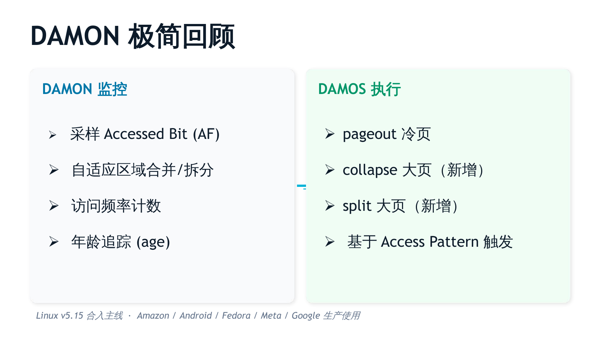

## 两个已知局限

### T1：TLB reach 造成的监测盲点

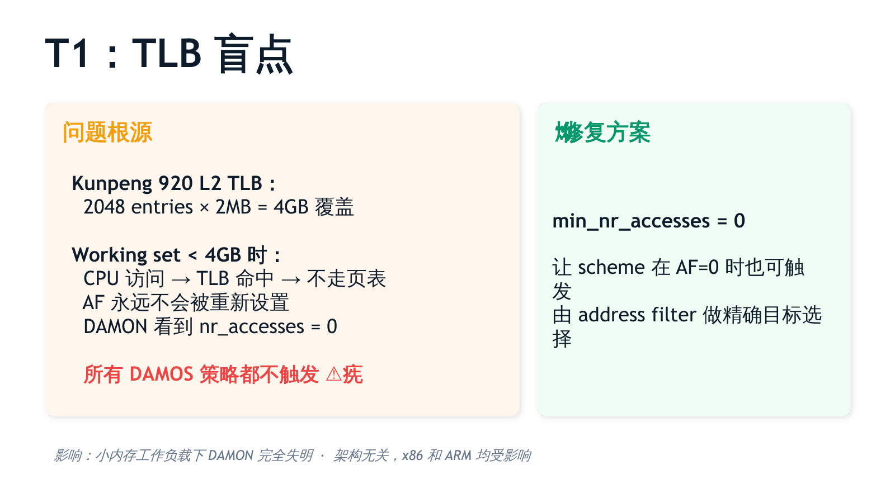

在 Kunpeng 920 上，L2 TLB 有 2048 个条目。使用 2 MiB THP 时，理论覆盖范围是 4 GiB。如果工作集小于这个范围，CPU 访问可能一直命中 TLB，不再走页表。DAMON 清除 AF 后，硬件也就没有机会通过新的页表遍历把它重新置位。DAMON 最后看到的 `nr_accesses` 始终是 0，依赖访问次数的 scheme 也不会触发。

这不是 Arm 独有的问题。`ptep_test_and_clear_young()` 在 x86_64 和 arm64 上都不会为这个操作刷新 TLB，因此它是一个与架构无关的盲点。我们目前把 T1 定位为实验室观察，还没有把它当成生产故障来描述。

一个实用的处理方式是把 `min_nr_accesses` 设为 0，让 scheme 在 AF 为 0 时也能运行，再由 address filter 精确选择目标地址。

### T2：PMD 粒度放大

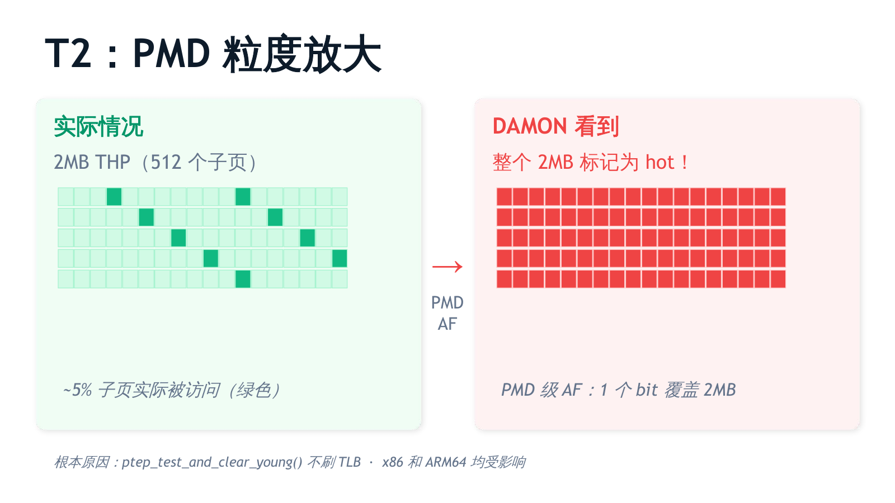

T2 才是生产环境真正遇到的问题。一个 2 MiB THP 包含 512 个 4 KiB 子页，却只由一个 PMD 级 AF 表示访问状态。只要其中一个子页被访问，DAMON 看到的就是整个 2 MiB 区域都热。它无法区分“整个 THP 都热”和“只有一个 4 KiB 子页热”，冷数据会藏在看起来很热的 THP 中。

我们在 Kunpeng 920 物理机上，对 KVM 加 Oracle DB 场景使用 Arm SPE 做采样分析。结果显示，94.6% 的 2 MiB THP 只有不到 10% 的子页真正被访问。也就是说，许多 THP 内部冷热很不均匀，单看 PMD 级 AF 会明显放大热内存规模。

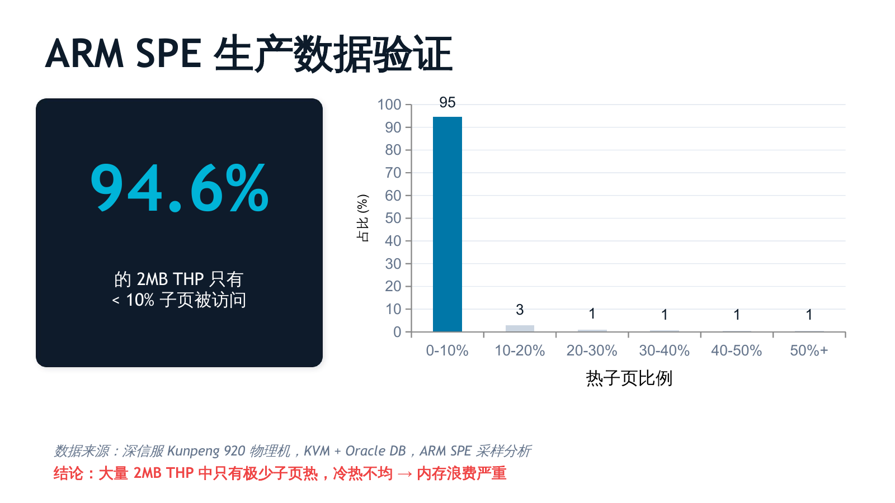

## 为 DAMOS 增加 mTHP 粒度的 collapse 和 split

我们的 v2 补丁集有 5 个补丁。

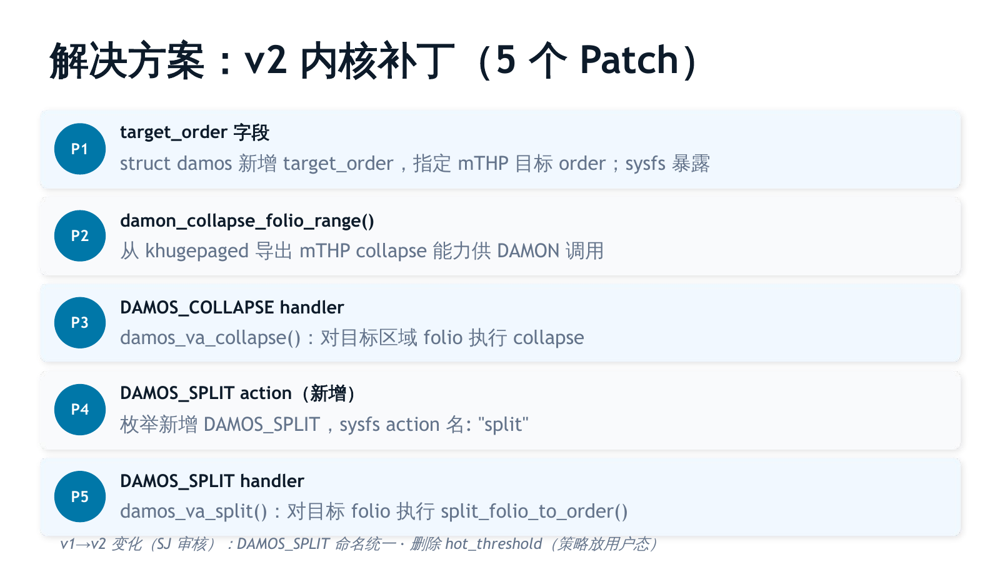

前三个补丁扩展已有的 `DAMOS_COLLAPSE`：在 `struct damos` 中增加 `target_order`，并通过 sysfs 暴露；从 `khugepaged` 导出 `damon_collapse_folio_range()`；最后在 DAMON 的虚拟地址操作集中接入 mTHP-aware collapse handler。

后两个补丁新增 `DAMOS_SPLIT`，让用户通过 `target_order` 指定要把大 folio 拆到哪个 order，底层调用 `split_folio_to_order()`。早期 RFC 中使用的名称是 `DAMOS_MTHP_SPLIT`，根据 SJ 的建议，v2 改成了更简洁、也与 `DAMOS_COLLAPSE` 一致的 `DAMOS_SPLIT`。`hot_threshold` 同样从内核接口中删除，具体冷热策略留在用户态。

## 内核提供机制，用户态决定策略

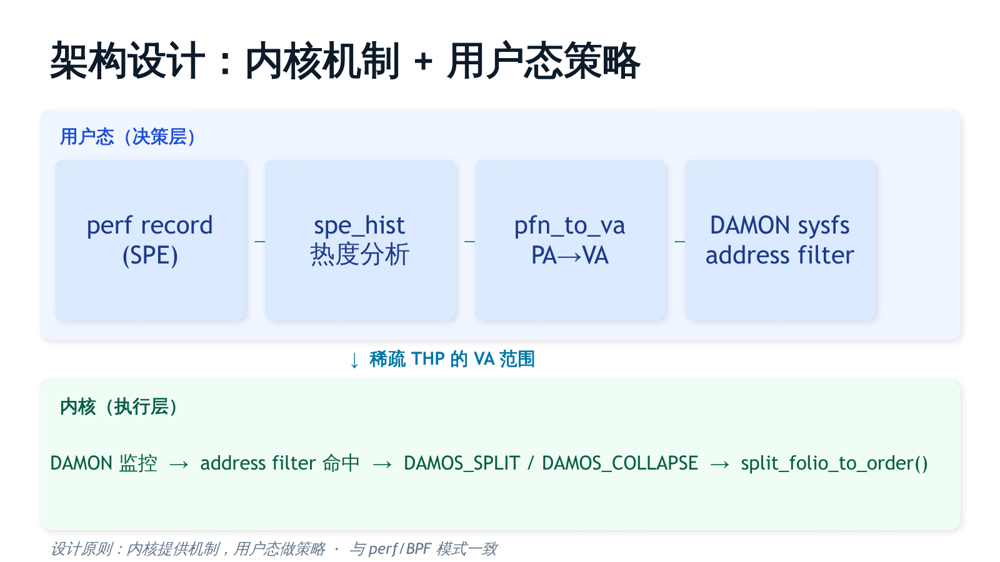

我们的整体设计是：内核只提供 collapse、split 和 address filter 这些机制，用户态决定哪些地址值得操作。

在有 Arm SPE 的机器上，用户态通过 `perf record` 取得 SPE 数据，再由 `spe_hist` 分析每个 THP 内部的热度。接下来把物理地址转换成进程虚拟地址，将稀疏 THP 的地址范围写入 DAMON sysfs 的 address filter。内核侧命中过滤条件后，再执行 `DAMOS_SPLIT` 或 `DAMOS_COLLAPSE`。

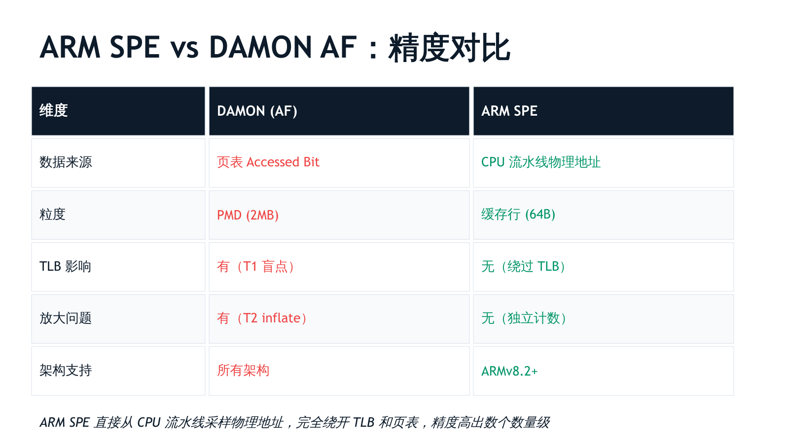

Arm SPE 从 CPU 流水线采样物理地址，不依赖页表 AF，也不受 TLB 命中的影响，粒度可以细到 cache line。DAMON 的 AF 路径适用于各种架构，开销低，但在 THP 场景下只能看到 PMD 粒度。两者适合分工：SPE 提供更精细的候选地址，DAMON 负责执行通用内核动作。

SPE 的一个现实限制是 PMU 通常采用单消费者模式。`perf` 正在使用 SPE 时，另一个消费者无法同时占用它；反过来也一样。因此，我们没有继续把 SPE 数据通过 `debugfs` 直接喂给内核，而是把采集和决策放在用户态，也保留以后替换为 AMD IBS 或 Intel PEBS 等数据源的空间。

## 测试进展

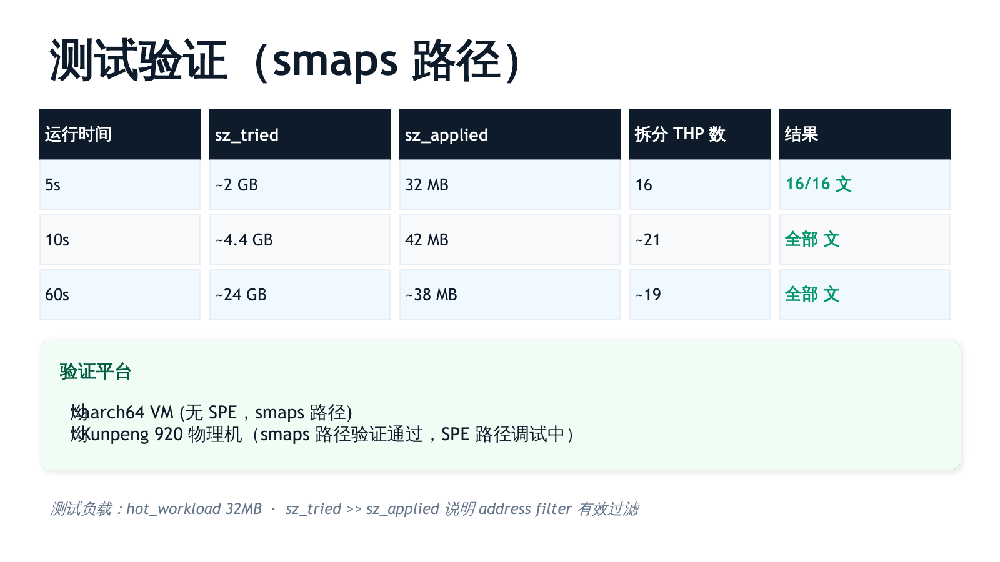

没有 SPE 时，可以扫描 `/proc/<pid>/smaps`，枚举由 THP 支撑的地址范围，再通过 address filter 选择目标。我们在 aarch64 虚拟机和 Kunpeng 920 物理机上验证了这条路径。测试中，`sz_tried` 覆盖整个监测范围，而 `sz_applied` 只统计被 address filter 选中的 THP，说明过滤确实把动作限制在目标区域。

当时 SPE 路径还在继续调试。实验室里已经用稀疏访问程序放大并复现了问题，但完整的深信服 KVM 加 Oracle DB 生产链路仍需要进一步做端到端验证。这些数据是为了说明问题和验证机制，不能直接当成所有生产负载的结论。

## 后续方向

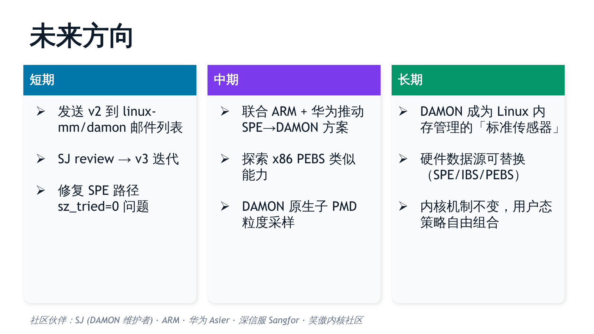

短期先根据邮件列表 review 继续修改 collapse/split 补丁，并把 SPE 用户态路径调通。中期希望和 Arm、华为及社区开发者一起推进 SPE 到 DAMON 的反馈方案，同时研究 x86 PEBS 和 AMD IBS 等类似能力。更长期的目标，是让 DAMON 成为 Linux 内存管理中一个标准、可替换数据源的“传感器”：内核机制保持稳定，策略和硬件监测源可以按场景组合。

这项工作得到了很多人的帮助。感谢 SJ 作为 DAMON 维护者给出的方向和 review，感谢 Kefeng Wang、Asier Gutierrez、Arm 和华为的伙伴参与讨论，也感谢深信服提供生产场景。笑傲内核社区和宋宝华老师在 THP 方向也给了我们很多建议。

后续如果大家在使用 DAMON 时碰到问题，欢迎在邮件列表继续交流，也可以直接联系我们。谢谢大家。

## 邮件列表与延伸阅读

下面的链接用于核对演讲中的 DAMON 设计、补丁版本和后续路线。补丁仍在邮件列表中迭代，最终接口应以上游合入版本为准。

### DAMON 官方资料

- [Linux 内核文档：DAMON](https://docs.kernel.org/mm/damon/)
- [Linux 内核文档：DAMON Design](https://docs.kernel.org/mm/damon/design.html)
- [DAMON 项目网站与社区介绍](https://damonitor.github.io/posts/damon/)
- [DAMON 邮件列表归档](https://lore.kernel.org/damon/)

### mTHP collapse/split 与 Arm SPE

- [王炼：`[RFC PATCH 0/6] mm/damon: Add mTHP-aware collapse/split with ARM SPE feedback` 讨论串](https://www.spinics.net/lists/kernel/msg6273679.html)
- [王炼：`[PATCH v2 0/5] mm/damon: add mTHP collapse and split actions`](https://lkml.iu.edu/2607.0/00984.html)
- [SJ 对 v2 补丁版本状态的回复](https://lkml.iu.edu/2607.0/01386.html)
- [SPE 用户态实验工具：`lianux-mm/damon_spe`](https://github.com/lianux-mm/damon_spe)

### 数据属性监测路线

- [SeongJae Park：DAMON 数据属性扩展项目讨论](https://lore.kernel.org/20260525225208.1179-1-sj@kernel.org/)
- [SeongJae Park：`[RFC PATCH v1.2 00/19] mm/damon: introduce data attributes only monitoring`（会后更新）](https://lore.kernel.org/20260709140600.90950-1-sj@kernel.org/)
